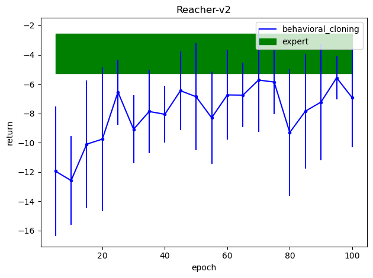
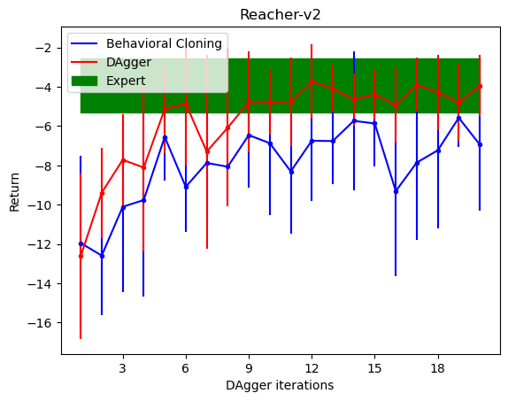
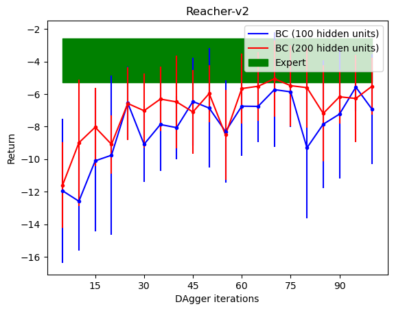

# CS294-112 HW 1: Imitation Learning

## Usage

To generate expert data for training, run

```bash
bash get_data.sh
```
To run all experiments and generate movies, tables and figures for the report, run

```bash
bash record_run.sh
```

### Question 2.2

|Task|Mean return (BC)|STD (BC)|Mean return (expert)|STD (expert)|
|---|---|---|---|---|
|Reacher-v2|-5.57|1.47|-3.93|1.36|

### Question 2.3 behavioral cloning

<p float="left">
  
</p>

### Question 3.2 dagger

<p float="left">
  
</p>

### Question 4.2 change hidden layer size of policy network

<p float="left">
  
</p>

